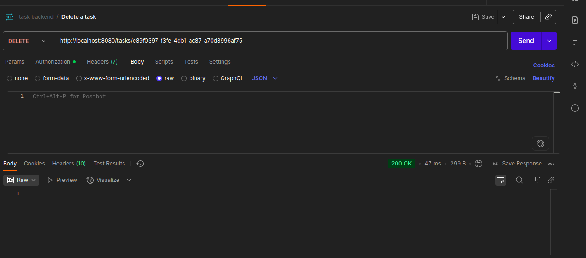

# Task Management System

A REST API built with Spring Boot for managing user authentication and tasks.

## Features

- User registration and login with JWT authentication
- Password hashing with BCrypt
- Task CRUD operations (Create, Read, Update, Delete)
- User-specific task access (users can only see/modify their own tasks)
- Comprehensive error handling with validation
- H2 in-memory database

## Technologies Used

- Java 21
- Spring Boot 3.5.5
- Spring Security
- Spring Data JPA
- JWT (JSON Web Tokens)
- H2 Database
- Maven (wrapper included)
- Lombok

## Getting Started

### Prerequisites

- Java 21 or higher
- No Maven installation required (Maven wrapper included)

### Installation

1. Clone the repository:
```bash
git clone https://github.com/Hammad8ahmad/task-management.git
cd Task-Management
```

2. Build the project:
```bash
# Unix/Linux/Mac
./mvnw clean install

# Windows
mvnw.cmd clean install
```

3. Run the application:
```bash
# Unix/Linux/Mac
./mvnw spring-boot:run

# Windows
mvnw.cmd spring-boot:run
```

The application will start on `http://localhost:8080`

### Database Access

The H2 console is available at: `http://localhost:8080/h2-console`

- **JDBC URL**: `jdbc:h2:mem:taskdb`
- **Username**: `sa`
- **Password**: (empty)

## API Endpoints

### Authentication

#### Register User
```http
POST /auth/register
Content-Type: application/json

{
  "email": "user@example.com",
  "password": "mypassword",
  "name": "John Doe"
}
```

#### Login User
```http
POST /auth/login
Content-Type: application/json

{
  "email": "user@example.com", 
  "password": "mypassword"
}
```

**Response:**
```json
{
  "accessToken": "eyJhbGciOiJIUzI1NiIsInR5cCI6IkpXVCJ9..."
}
```

#### Logout User
```http
POST /auth/logout
Authorization: Bearer <your-jwt-token>
```

**Response:**
```json
{
  "message": "Logged out successfully"
}
```

### Task Management
*All task endpoints require authentication with JWT token in Authorization header*

#### Get All Tasks (User-specific)
```http
GET /tasks
Authorization: Bearer <your-jwt-token>
```

#### Create Task
```http
POST /tasks
Authorization: Bearer <your-jwt-token>
Content-Type: application/json

{
  "title": "Complete project",
  "description": "Finish the task management system",
  "status": "OPEN"
}
```

#### Update Task
```http
PUT /tasks/{task-id}
Authorization: Bearer <your-jwt-token>
Content-Type: application/json

{
  "title": "Updated task title",
  "description": "Updated description", 
  "status": "DONE"
}
```

#### Delete Task
```http
DELETE /tasks/{task-id}
Authorization: Bearer <your-jwt-token>
```

## Postman API Testing

The following screenshots demonstrate the API endpoints being tested with Postman:

### User Registration


### User Login


### Create Task


### Get Tasks


### Update Task


### Delete Task


## Task Status Values

- `OPEN` - Task is open and pending
- `PENDING` - Task is pending action
- `DONE` - Task is completed

## Error Handling

The API returns appropriate HTTP status codes and error messages:

- **400 Bad Request** - Validation errors or malformed requests
- **401 Unauthorized** - Invalid credentials or missing/invalid JWT token
- **403 Forbidden** - Attempting to access another user's resources
- **404 Not Found** - Resource not found
- **409 Conflict** - Duplicate data (e.g., email already exists)
- **500 Internal Server Error** - Unexpected server errors

### Example Error Responses

**Validation Error (400):**
```json
{
  "status": 400,
  "message": "Validation failed",
  "errors": {
    "email": "Email should be valid",
    "password": "Password must be at least 6 characters"
  }
}
```

**Authentication Error (401):**
```json
{
  "status": 401,
  "message": "Invalid email or password"
}
```

**Authorization Error (403):**
```json
{
  "status": 403,
  "message": "You are not authorized to access this task"
}
```

## Example Usage with cURL

### Register a new user
```bash
curl -X POST http://localhost:8080/auth/register \
  -H "Content-Type: application/json" \
  -d '{"email":"test@example.com","password":"password123","name":"Test User"}'
```

### Login
```bash
curl -X POST http://localhost:8080/auth/login \
  -H "Content-Type: application/json" \
  -d '{"email":"test@example.com","password":"password123"}'
```

### Create a task (replace TOKEN with actual JWT)
```bash
curl -X POST http://localhost:8080/tasks \
  -H "Content-Type: application/json" \
  -H "Authorization: Bearer TOKEN" \
  -d '{"title":"My Task","description":"Task description","status":"OPEN"}'
```

### Get all tasks
```bash
curl -X GET http://localhost:8080/tasks \
  -H "Authorization: Bearer TOKEN"
```

### Update a task
```bash
curl -X PUT http://localhost:8080/tasks/{task-id} \
  -H "Content-Type: application/json" \
  -H "Authorization: Bearer TOKEN" \
  -d '{"title":"Updated Task","description":"Updated description","status":"DONE"}'
```

### Delete a task
```bash
curl -X DELETE http://localhost:8080/tasks/{task-id} \
  -H "Authorization: Bearer TOKEN"
```

### Logout
```bash
curl -X POST http://localhost:8080/auth/logout \
  -H "Authorization: Bearer TOKEN"
```

## Project Structure

```
src/main/java/com/hammad/task/
├── config/                 # Security and JWT configuration
│   ├── JwtFilter.java     # JWT authentication filter
│   └── SecurityConfig.java # Spring Security configuration
├── controllers/            # REST controllers
│   ├── TaskController.java # Task management endpoints
│   ├── UserController.java # Authentication endpoints
│   └── GlobalExceptionsHandler.java # Global error handling
├── domain/
│   ├── dtos/              # Data Transfer Objects
│   │   ├── TaskDto.java   # Task DTO with validation
│   │   └── ErrorResponse.java # Error response format
│   └── entities/          # JPA entities
│       ├── Task.java      # Task entity with user relationship
│       ├── User.java      # User entity with validation
│       ├── UserPrincipal.java # Spring Security user details
│       └── Status.java    # Task status enum
├── filters/               # Request/response filters
├── mappers/               # Entity-DTO mappers
│   └── Impl/
│       └── TaskMapperImpl.java # Task mapping implementation
├── repositories/          # JPA repositories
│   ├── TaskRepository.java # Task data access
│   └── UserRepository.java # User data access
└── services/              # Business logic
    ├── Impl/
    │   └── TaskServiceImpl.java # Task business logic
    ├── JwtService.java    # JWT token management
    ├── MyUserDetailsService.java # User authentication
    └── UserService.java   # User business logic
```

## Security Features

- JWT-based stateless authentication
- Password hashing with BCrypt
- User-specific data access (users can only access their own tasks)
- Protected endpoints with Spring Security
- Comprehensive input validation
- Authorization checks for task operations

## Configuration

The application uses the following configuration in `application.properties`:

```properties
# H2 Database
spring.datasource.url=jdbc:h2:mem:taskdb
spring.datasource.driver-class-name=org.h2.Driver

# JWT Configuration
jwt.secret=mySecretKey123456789012345678901234567890
jwt.expiration=86400000

# H2 Console
spring.h2.console.enabled=true
spring.h2.console.path=/h2-console
```

## Development

To run tests:
```bash
# Unix/Linux/Mac
./mvnw test

# Windows
mvnw.cmd test
```

To generate build artifacts:
```bash
# Unix/Linux/Mac
./mvnw package

# Windows
mvnw.cmd package
```

## Assignment Requirements Fulfilled

**User Registration** - POST /auth/register with email, password, name  
**User Login** - POST /auth/login returning accessToken (JWT)  
**User Logout** - POST /auth/logout with token invalidation  
**Task Creation** - POST /tasks with title, description, status  
**Task Retrieval** - GET /tasks (user-specific filtering)  
**Task Updates** - PUT /tasks/{id} (user-specific authorization)  
**Task Deletion** - DELETE /tasks/{id} (user-specific authorization)  
**Authentication** - JWT-based token authentication  
**Security** - BCrypt password hashing  
**Error Handling** - Proper HTTP status codes and error responses  
**Authorization** - Users can only access their own tasks  

## Notes

- This application is designed for educational purposes
- H2 in-memory database resets on application restart
- JWT tokens are valid for 24 hours
- All passwords are securely hashed using BCrypt
- Users can only see and manage their own tasks
- Maven wrapper is included, no separate Maven installation required
